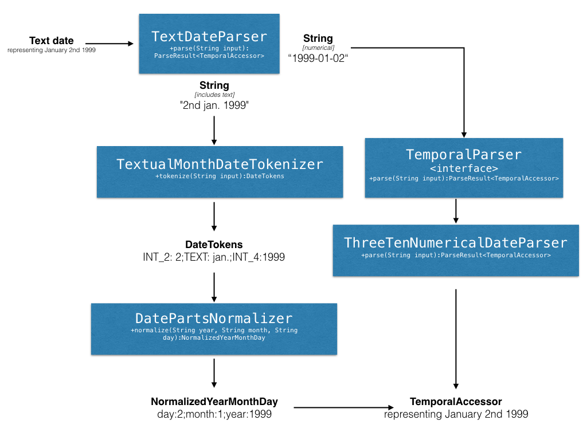

# Date Parsing - Design Notes

Design overview


## Entry points
There is 2 main methods in [TextDateParser](http://gbif.github.io/parsers/apidocs/org/gbif/common/parsers/date/TextDateParser.html) to parse dates represented in String.
They both return a ParseResult<TemporalAccessor> object.
```
- parse(String input)
- parse(String year, String month, String day)
```

## TextDateParser Workflow

In order to use the right parser, the TextDateParser will use a regex to determine if the input String contains only
numerical characters and separators or if it also include some letters. the presence of letters may indicate the month
is written in text as opposed to its numerical value.

### ThreeTenNumericalDateParser
The ThreeTenNumericalDateParser contains a predefined set of date formats built on top of the [Threeten Backport](http://www.threeten.org/threetenbp/) project.

By default, this parser will not parse dates containing the year expressed as 2 digits. This feature can be enabled by using
the static method `getParser(Year baseYear)`.

It is also possible to give a hint to the parser when the order or the granularity of the date components is known.
The enumeration [DateFormatHint](http://gbif.github.io/parsers/apidocs/org/gbif/common/parsers/date/DateFormatHint.html)
contains the possible values.

```java
ThreeTenNumericalDateParser THREETEN_NUMERICAL_PARSER = ThreeTenNumericalDateParser.getParser();

//this ParseResult will not be successful since this date is ambiguous
ParseResult<TemporalAccessor> ta = THREETEN_NUMERICAL_PARSER.parse("02/01/1999");

//but if we provide a DateFormatHint, we can get the expected result
ta = THREETEN_NUMERICAL_PARSER.parse("02/01/1999", DateFormatHint.MDY);
// or
ta = THREETEN_NUMERICAL_PARSER.parse("02/01/1999", DateFormatHint.DMY);
```

### TextualMonthDateTokenizer
